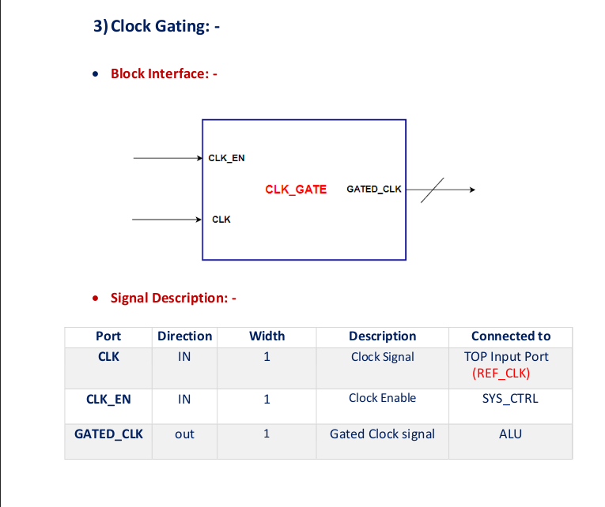
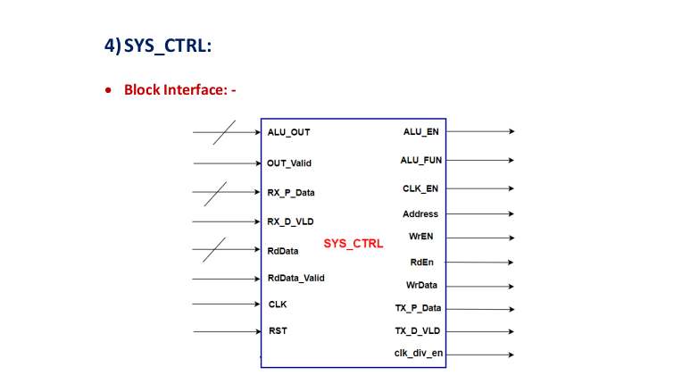
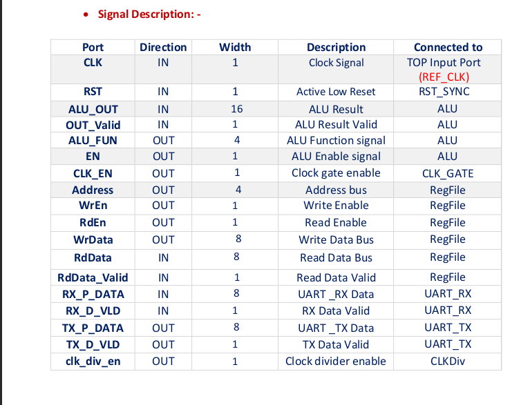
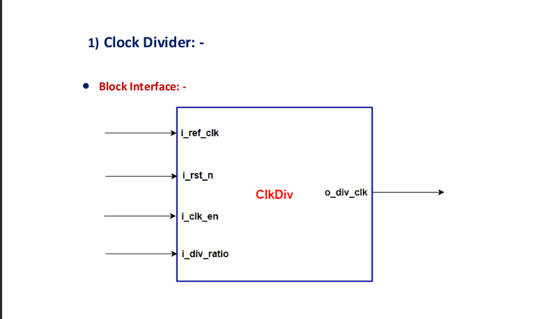
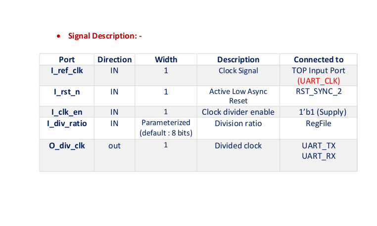

## Universal Asynchronous Receiver-Transmitter (UART)
The following diagram represents a block-level view of a digital system that includes a Universal Asynchronous Receiver-Transmitter (UART) communication system, an Arithmetic Logic Unit (ALU), a Register File (RegFile), and associated control logic. 

### Here's a breakdown of each part and its function:
1. **RegFile (Register File)** : The Register File is a small, fast storage area used to hold temporary data and operands needed by the ALU.

  
  

2. **ALU (Arithmetic and Logic Unit)** : The Unit is responsible of doing arithmetic and logic operations to the system.

  
  

3. **Clock Gating** : In a UART or other communication IPs, reducing power consumption is often crucial, especially in battery-powered or low-power applications. Clock gating is employed to disable the clock in parts of the system that are not currently in use, effectively reducing dynamic power consumption by decreasing the switching activity.

 

4. **System Control (Control Unit)** : This module orchestrating how the UART work you can say that this is the brain of the IP. It is a finite state machine consists of states connected together and in each state there are signals that make certain module work.

  
  

5. **Clock Divider** : The clock divider, used in UART and other digital communication circuits to generate a clock signal at a lower frequency than the input reference clock. The module allows configurable division ratios set.

  
  

