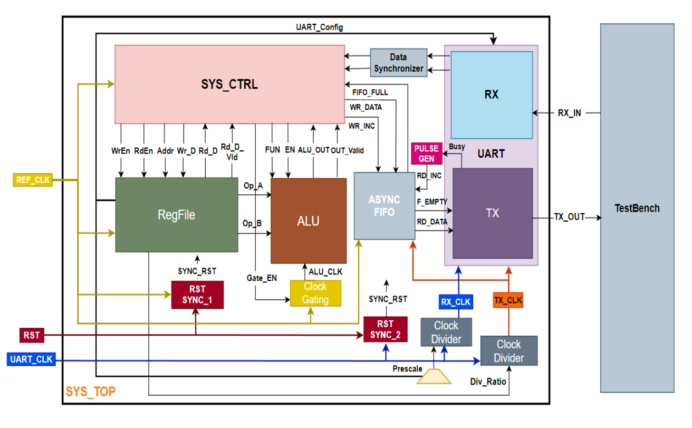
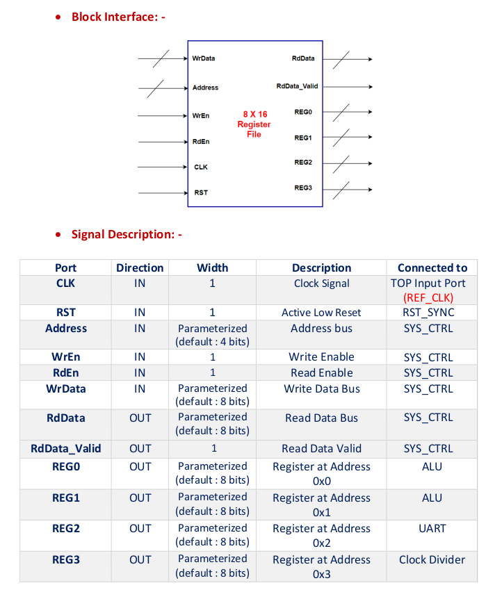
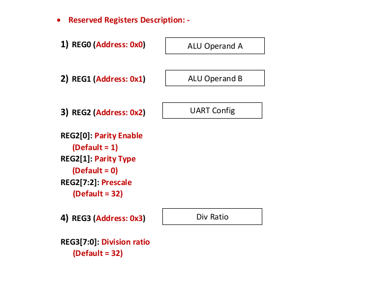
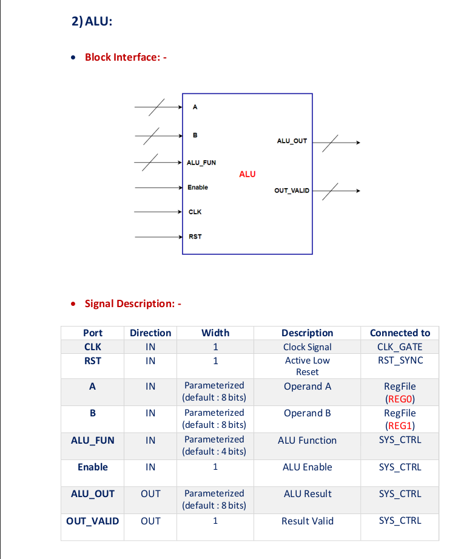
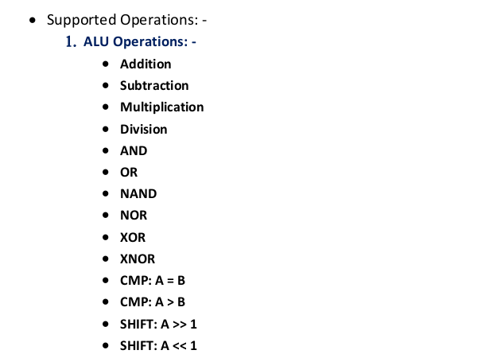

## Universal Asynchronous Receiver-Transmitter (UART)
The following diagram represents a block-level view of a digital system that includes a Universal Asynchronous Receiver-Transmitter (UART) communication system, an Arithmetic Logic Unit (ALU), a Register File (RegFile), and associated control logic. 

### Here's a breakdown of each part and its function:
1. **RegFile (Register File)** : The Register File is a small, fast storage area used to hold temporary data and operands needed by the ALU.

  
  

1. **ALU (Arithmetic and Logic Unit)** : The Unit is responsible of doing arithmetic and logic operations to the system.

  
  

